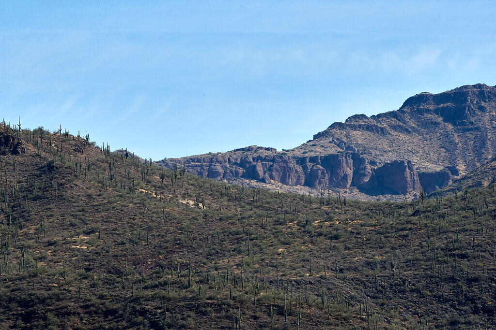

# Jittor 赛题一：风景图片生成赛题

## 赛题介绍

图像生成任务一直以来都是十分具有应用场景的计算机视觉任务，从语义分割图生成有意义、高质量的图片仍然存在诸多挑战，如保证生成图片的真实性、清晰程度、多样性、美观性等。

清华大学计算机系图形学实验室从Flickr官网收集了1万两千张高清（宽1024、高768）的风景图片，并制作了它们的语义分割图。其中，1万对图片被用来训练。训练数据集可以从[这里](https://cloud.tsinghua.edu.cn/f/1d734cbb68b545d6bdf2/?dl=1)下载。**其中 label 是值在 0~28 的灰度图，可以使用 matplotlib.pyplot.imshow 可视化。**下面展示了一组图片。

 

标签包括29类物体，分别是  

```
"mountain", "sky", "water", "sea", "rock", "tree", "earth", "hill", "river", "sand", "land", "building", "grass", "plant", "person", "boat", "waterfall
```

## 赛题内容

本赛题将会提供1000张测试分割图片，参赛选手需要根据测试图片生成符合标签含义的风景图片。

## 简介

本项目包含了第二届计图挑战赛计图 - 风景图片生成赛题的代码实现。A榜得分0.4119，排名25，B榜得分0.4041，排名19

## 安装 

本项目可在CPU||GPU环境下训练，在GPU环境下训练约需要24小时

#### 运行环境

- ubuntu 20.04 LTS
- python >= 3.7
- jittor >= 1.3.0

#### 安装依赖

执行以下命令安装 python 依赖

```
pip install -r requirements.txt
```

#### 预训练模型

无

## 数据预处理

无

## 训练

```shell
nohup python -u train.py &
```

生成结果

```shell
python test.py --input_path 测试数据路径 --output_path ./results
```


## 推理

无

## 致谢

无
